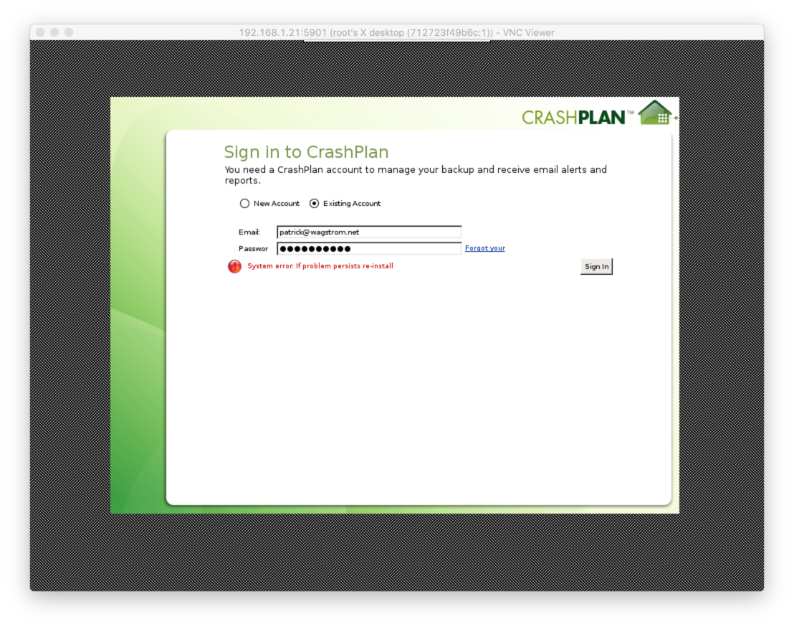

Crashplan for Odroid
====================

Patrick Wagstrom &lt;patrick@wagstrom.net&gt;

April 2017

**WARNING: In Octber 2016, Code 42, the company behind CrashPlan made changes to CrashPlan that introduced a new closed source shared library, `c42archive.so`. This library prevents CrashPlan from functioning on ARM architectures.**

The [Odroid C2][odroid] is a powerful little computer. It packs four 64 bit arm cores running at 1.5GHz with 2GiB of RAM in a form factor that's about the
same size as a Raspberry Pi 3 for about the same cost as a Raspberry Pi. Combined with gigabit ethernet and the ability to use eMMC for system
storage, this makes a reasonably fast computer for serving data over a network.

Unfortunately, the developer community isn't nearly as robust. Things that would be trivial on a Raspberry Pi are much more complicated because
it seems there are two orders of magnitude fewer Odroids in the wild and also because the Odroid is stuck on an ancient Linux kernel (3.14 because
of Amlogic). So, given that it's difficult to develop on, it makes a perfect system for running my backups. Using Crashplan. Which is Java. On
ARMv8 64bit. Under Docker. With noVNC for remote emulation.

Clearly this is not one of my best life choices.

Installing Docker on the Odroid C2
----------------------------------

To be honest, I don't remember how I did this. I think it was just a matter of running the following command as root on my odroid host system:

    apt-get install docker.io

Building the Package
--------------------

Because this `Dockerfile` downloads both Java and Crashplan, which don't allow redistribution, I'm unable to provide a pre-built image for this
project. Luckily it should be easy to build, just clone this project and then run:

    docker build -t "odroid-crashplan" .

Configuring the Image
---------------------

There's not much to do to configure this image. I had hoped to do more, but the fact that CrashPlan made changes in October 2016 that keep CrashPlan from running on ARM systems seriously limits the long term viability of this project.

There are two directories that you'll need to consider, the first is where you want the configuration files persisted for CrashPlan, the second is where you want the shared storage to appear for the system. In my case, the configuration will be stored in `/home/odroid/crashplan-docker` and the backups are on a Drobo that is mounted at `/mnt/Drobo-Crashplan`.

Starting the Image
------------------

Log into your odroid and run the following command remembering to replace the path names as previously discussed.

    docker run -d -it --name="CrashPlan" \
           --net="bridge" \
           -p 4242:4242 \
           -p 4243:4243 \
           -p 5901:5901 \
           -v "/home/odroid/crashplan-docker":"/config":rw \
           -v "/mnt/Drobo-Crashplan":"/backup":rw \
            odroid-crashplan /bin/bash

If you've made it this far, you've now got a docker image running CrashPlan on your odroid. Unfortunately, it's not configured and isn't signed into Code42 at this moment. You'll need to connect to the UI to set that up.

Administering Crashplan in the Image
------------------------------------

This is the end of the line for what you can do. Everything will start up, but you're not going to be able to sign in because of the introduction of the `c42archive.so` library. This is a native library that is only provided for x86 and x86\_64 system. If you're on an ARM system, you can do this, but it's going to fail.

There are two ways to adminsiter this, the first is by [treating it as a headless remote system][headless]. This means you'll be doing some SSH connections back and forth, copying files, changing the configuration on your location machine, and all other sorts of stuff. That's less than ideal.

The easier way is to take advantage of the fact that there is a VNC server built into this system. You'll need to connect to the host machine running the docker container first, and then execute the following command to connect to the running container:

    docker exec -it CrashPlan /bin/bash

This will drop you into the container running as root. Now, just start up the VNC server and then start up the CrashPlan desktop. When starting the TightVNC server it will ask you for a password the first time. You'll need this password to connect later.

    USER=root tightvncserver
    DISPLAY=:1 /usr/local/crashplan/bin/CrashPlanDesktop

Finally, on your local machine open up your VNC viewer and connect to port 5801 of your docker host machine. After securing access with your password you'll be dropped into the CrashPlan Desktop, where you'll quickly eperience system error that tells you to re-install. The root cause of this, if you dig around enough in `/usr/local/crashplan/log` is that CrashPlan is attemptng to load `c42archive.so`, however there is no version of this shared library for ARM architecures. Therefore, this is as far as you're going get.

<figure></figure>

License
-------

The code for this `Dockerfile` is licensed under the MIT License. There are separate license agreements required for Java and Crashplan.

[odroid]: http://www.hardkernel.com/main/products/prdt_info.php?g_code=G145457216438
[headless]: https://support.code42.com/CrashPlan/4/Configuring/Using_CrashPlan_On_A_Headless_Computer
